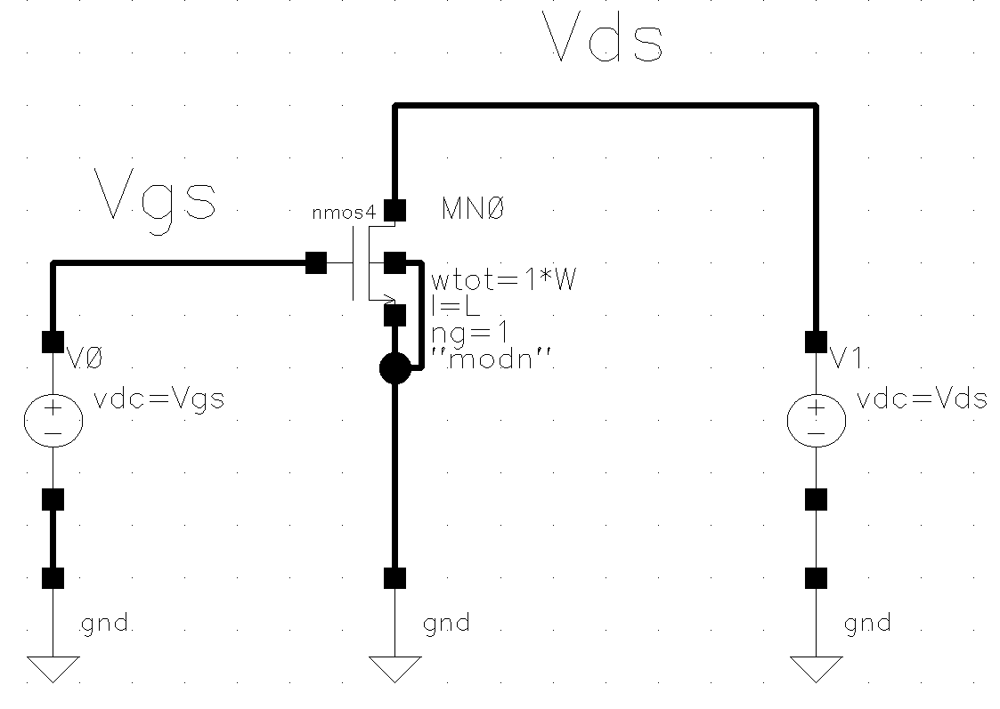
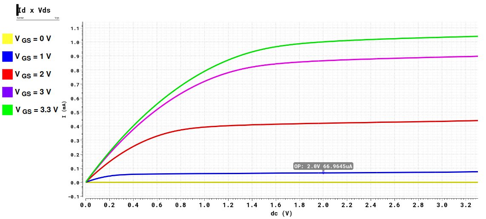
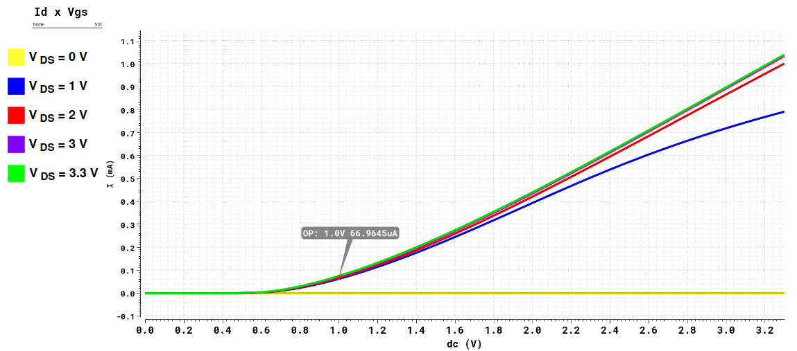
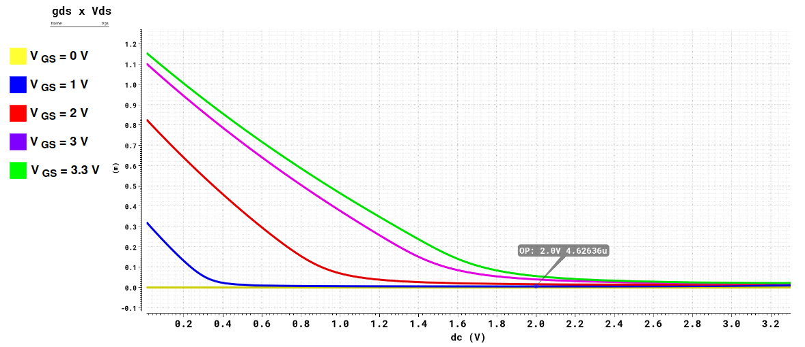
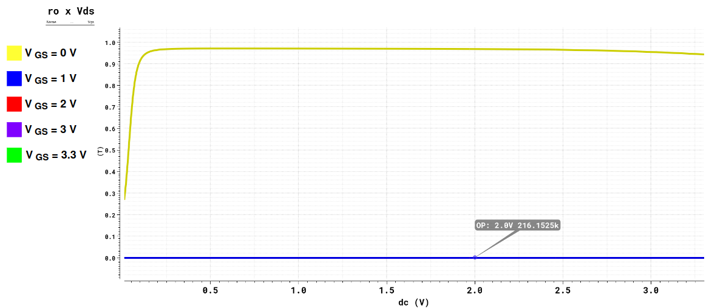
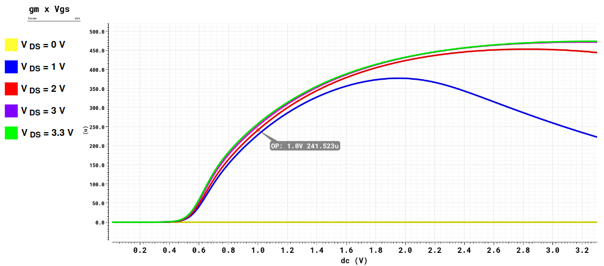
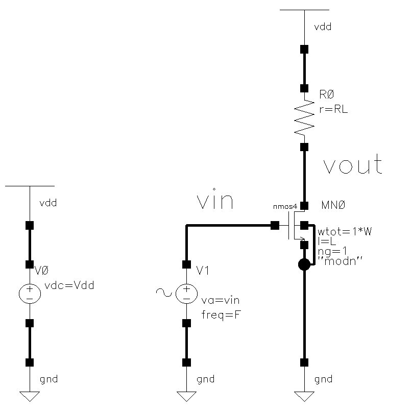
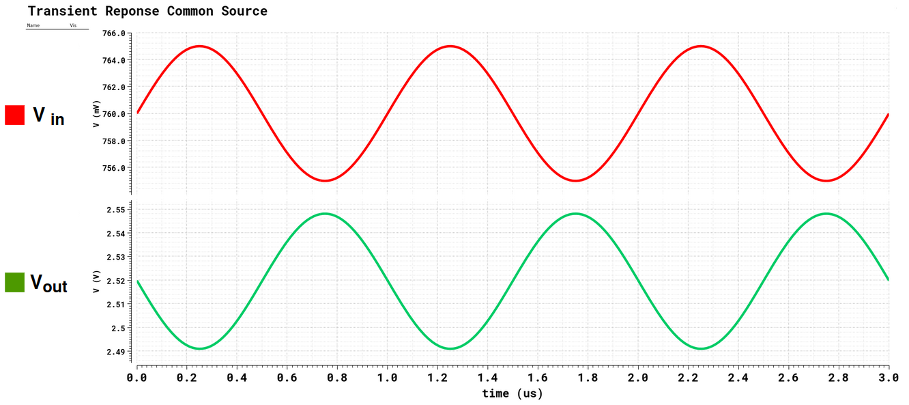
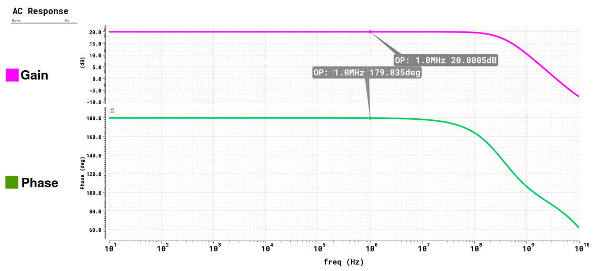

# NMOS Characterization & Common-Source Amplifier — AMS 0.35 µm (Cadence Virtuoso)

This project presents the **characterization of an NMOS transistor** (AMS CMOS 0.35 µm) and the design of a **common-source amplifier** in **Cadence Virtuoso**.  
It focuses on the extraction of electrical parameters, visualization of characteristic curves, and the analytical design and simulation of a small-signal amplifier.

---

## 🔎 Overview
- **NMOS characterization:** DC operating point, transfer and output curves, and small-signal parameters.  
- **Parameter extraction:** (gm), (gds), (ro = 1/gds), and (k'n).  
- **Common-source amplifier:** sizing to reach about **20 dB** gain and (Vout,DC ≈ VDD/2).  
- **Verification:** time-domain and frequency-domain simulations in Virtuoso ADE.

---

## 🧪 NMOS Characterization

**Characterization schematic (Virtuoso)**  


### DC operating point
Bias conditions:
```
VGS = 1.0 V  
VDS = 2.0 V  
L = 350 nm  
W = 2 µm
```

Extracted parameters (from ADE):

| Parameter | Symbol | Value |
|------------|---------|--------|
| Drain current | ID | 66.96 µA |
| Threshold voltage | Vth | 548.2 mV |
| Transconductance | gm | 243.5 µS |
| Output conductance | gds | 4.601 µS |
| Output resistance | ro = 1/gds | 217.3 kΩ |
| Saturation voltage | VDSAT | 318.3 mV |

> Channel-length modulation: λ = gds / ID ≈ 6.87×10⁻² V⁻¹  
> Process parameter at this bias:  
> k'n ≈ 2·ID / [(W/L)(VGS−Vth)²(1+λ·VDS)] ≈ 101 µA/V²

---

**ID vs VDS (VGS sweeps)**  


**ID vs VGS (VDS sweeps)**  


---

### Derived parameters from curves

- From ID(VDS) → slope gives gds, then ro = 1/gds  
    
  
- From ID(VGS) → slope gives gm  
  

---

## 🎛️ Common-Source (CS) Amplifier

**Schematic (Virtuoso)**  


### Initial configuration

| Parameter | Symbol | Value |
|------------|---------|--------|
| Supply voltage | VDD | 3.3 V |
| Gate bias | Vbias | 760 mV |
| Load resistor | RL | 16 kΩ |
| Device width | W | 22 µm |
| Device length | L | 2 µm |
| Input amplitude | Vin | 5 mV |
| Frequency | F | 1 MHz |

**Transient simulation (time domain)**  


- The amplifier exhibits a **phase inversion** between input and output.  
- Measured peak-to-peak gain:  
  ```
  Av = Vout_pp / Vin_pp = 5.71 V/V ≈ 15.1 dB
  ```

**AC simulation (frequency response)**  


---

## 📐 Analytical sizing toward 20 dB

### Design objectives
```
Vout_DC ≈ VDD/2 = 1.65 V  
|Av| ≈ 10 V/V  (~20 dB)  
PDC ≤ 100 µW
```

---

### Step 1 — choose drain current
```
PDC = VDD · ID  
ID = PDC / VDD  
ID = 100 µW / 3.3 V ≈ 30.3 µA
```

---

### Step 2 — select load resistor
For mid-supply DC output:
```
VR = RL · ID = VDD / 2  
RL = (VDD / 2) / ID  
RL = 1.65 V / 30.3 µA ≈ 54.5 kΩ
```

---

### Step 3 — gain model
```
Av = − gm · (RL ∥ ro)
```
Assuming ro ≫ RL, we can use:
```
Av ≈ − gm · RL
```
For the NMOS, ro ≈ 0.9 MΩ, making this approximation valid.

---

### Step 4 — required transconductance
```
|Av| = 10 = gm · RL  
gm = 10 / 54.5 kΩ = 184 µS
```

---

### Step 5 — overdrive and gate voltage
```
gm = 2·ID / Vov  
Vov = 2·ID / gm  
Vov = 2·30.3 µA / 184 µS ≈ 0.33 V
```
With Vth = 0.55 V:
```
VGS = Vth + Vov = 0.55 + 0.33 = 0.88 V
```

---

### Step 6 — W/L estimation
```
ID = (1/2) · k'n · (W/L) · (VGS − Vth)² · (1 + λ·VDS)
(W/L) = 2·ID / [k'n · (VGS−Vth)² · (1 + λ·VDS)]
(W/L) = 2·30.3 µA / [101 µA/V² · (0.33 V)² · (1 + 0.07·2)] ≈ 5.2
```
Keeping L = 2 µm → W ≈ 10.4 µm.

---

### Step 7 — fine tuning
Parametric sweeps in ADE were run for:
```
VGS: 0.80–0.83 V  
W:   9–11 µm
```

The intersection of the curves where Av = 10 and Vout_DC = 1.65 V  
gave the optimal point:
```
W = 7.9 µm  
VGS = 0.813 V
```

Final AC verification:


- Achieved gain ≈ 20 dB  
- Output DC ≈ 1.65 V  
- Drain current ≈ 30 µA  
- Static power ≈ 100 µW

---

## 🗂️ Repository layout
```
mosfet-nmos-char-cs-ams035/
├─ README.md
├─ Figures/
│  ├─ NMOS_schem.png
│  ├─ id_vds.png
│  ├─ id_vgs.png
│  ├─ gds_NMOS.png
│  ├─ ro_NMOS.png
│  ├─ gm_NMOS.png
│  ├─ cm_schem.png
│  ├─ tran.png
│  └─ ac_final.png
└─ docs/
   └─ TP1___Caractérisation_des_transistors_MOSFET_et_analyse_d_un_amplificateur_source_commune.pdf
```

---

**Authors:** Murilo Muller · Thomas Pichot  
**Professor:** Jean-Max Dutertre  
**Date:** September 13, 2025

